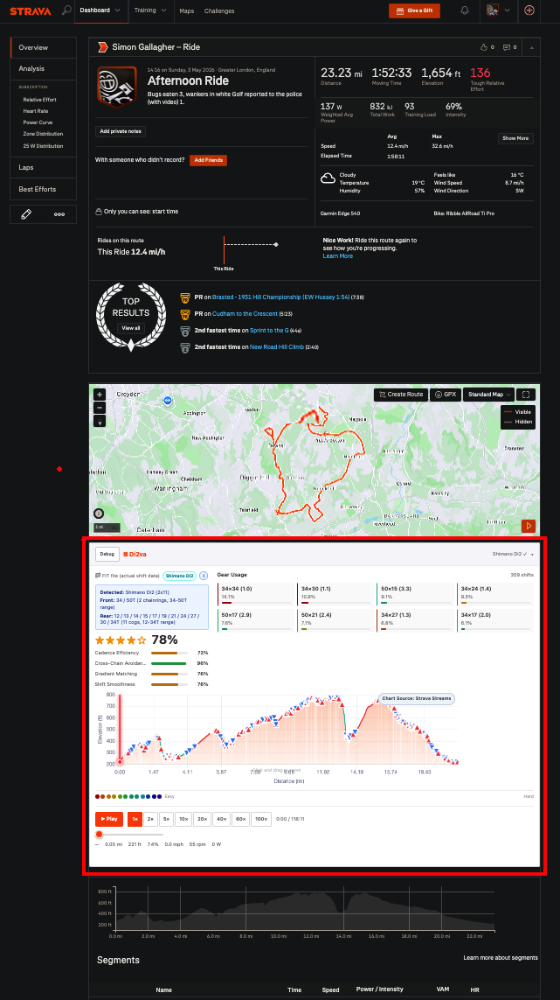
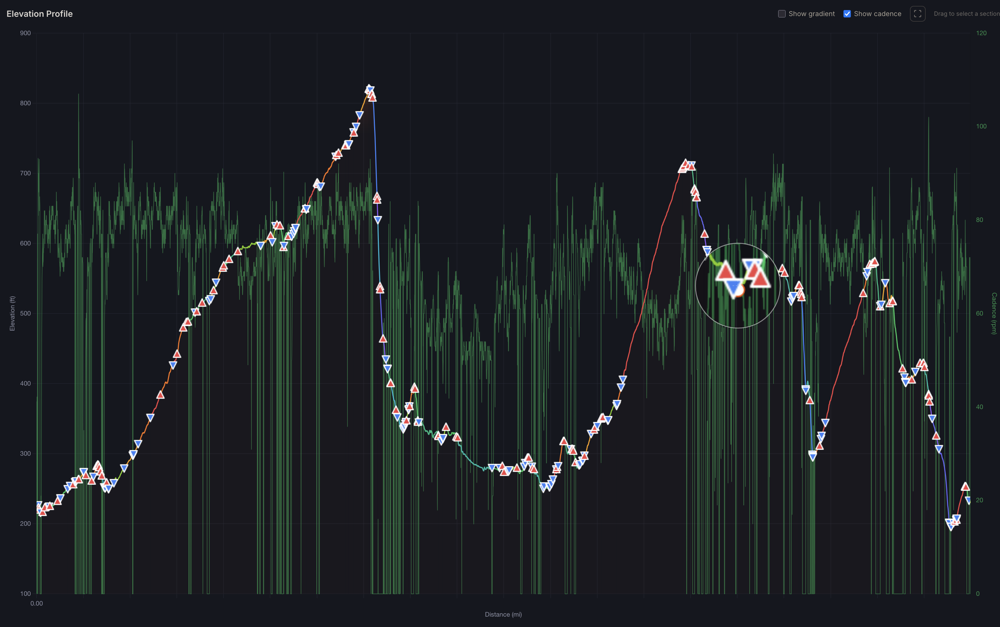
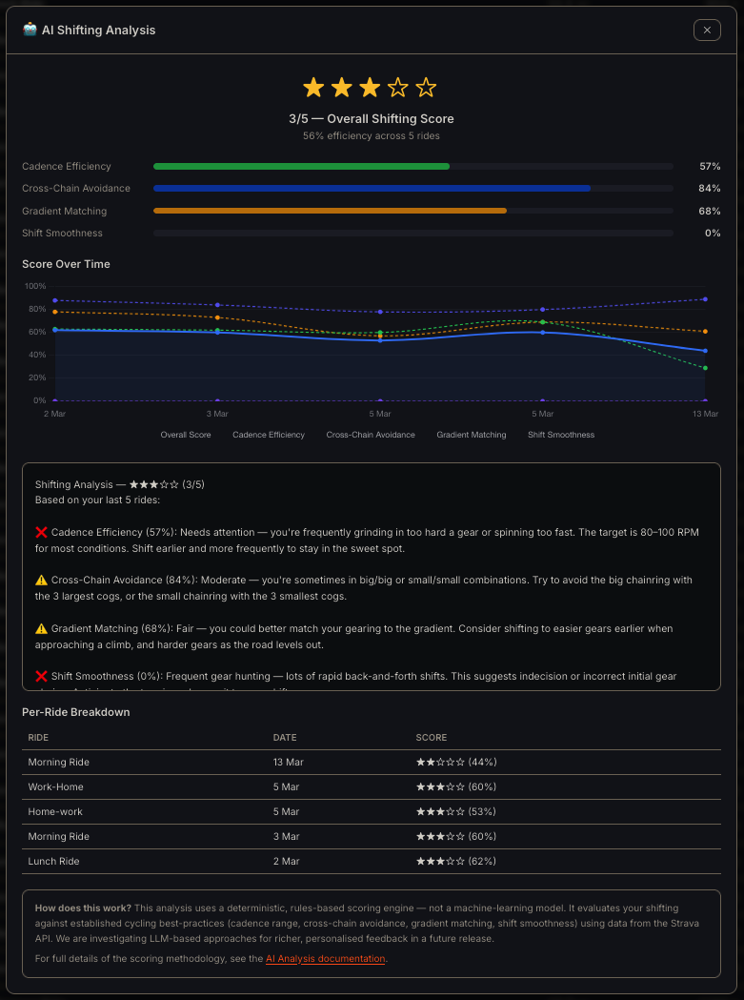

# Di2va

> **Why does this exist?** Gear-shifting data has been a long-standing feature request in the Strava community — cyclists with electronic groupsets (Shimano Di2, SRAM AXS, Campagnolo EPS) upload FIT files that contain every shift event, yet Strava doesn't surface any of it. The request didn't seem to be moving, so I built my own tool. You may find it useful or, at the very least, interesting.

**Visualize your Shimano Di2 electronic gear shift data on Strava** — see exactly what gear you were in at every point on the elevation profile, with interactive gear statistics, an animated drivetrain replay, and real-time shifting analysis.

[](https://addons.mozilla.org/en-US/firefox/addon/gearshift-overlay-for-strava)



*Di2va browser extension injected on a Strava activity page — shifting quality score, gear usage cards, gear-colored elevation profile with drag-to-zoom, animated drivetrain replay with real-time shifting analysis.*

## Firefox Browser Extension

> **Now available on [Firefox Add-ons](https://addons.mozilla.org/en-US/firefox/addon/gearshift-overlay-for-strava)** — install with one click, auto-updates included.

The extension injects Di2va directly into Strava activity pages — no separate web app, no OAuth setup. It uses your existing Strava browser session to fetch streams and FIT data.

### Features

- **No OAuth setup** — Uses your existing Strava session (no API keys needed)
- **Elevation Chart with Gear-Colored Segments** — Full-width elevation profile below the Strava map, color-coded by gear
- **Drag-to-Zoom** — Select a section of the elevation chart to zoom in with section scores
- **Animated Drivetrain Replay** — SVG transmission animation plays back your ride with cadence-driven crank rotation
- **Real-Time Shifting Analysis** — Live tick/cross feedback on cadence efficiency, cross-chain avoidance, and gradient matching as playback progresses
- **Coasting & Stopped Detection** — Distinguishes between pedalling, coasting, and stopped states
- **Playback Controls** — Play/pause, speed (1×–20×), scrubber, and time display
- **Dark Mode** — Automatic detection of Strava/Sauce dark themes
- **Unit Detection** — Reads your Strava unit preferences (metric/imperial)
- **Firefox & Chrome** — MV3 WebExtension compatible with both browsers

### Install from Firefox Add-ons (Recommended)

[](https://addons.mozilla.org/en-US/firefox/addon/gearshift-overlay-for-strava)

One click, auto-updates included. Requires Firefox 140+.

### Install Manually (Firefox)

1. Clone and build the extension:

```bash
git clone https://github.com/vinfnet/Di2va.git
cd Di2va/extension
npm install
npm run build
```

2. Open `about:debugging#/runtime/this-firefox` in Firefox
3. Click **Load Temporary Add-on...**
4. Select any file inside the `extension/dist/` folder (e.g. `manifest.json`)
5. Navigate to any Strava activity page — Di2va appears below the map

> **Note:** Temporary add-ons are removed when Firefox restarts. Once the AMO review is complete, the extension will auto-update from the Firefox Add-ons site.

### Install Manually (Chrome)

```bash
git clone https://github.com/vinfnet/Di2va.git
cd Di2va/extension
npm install
npm run build
```

1. Open `chrome://extensions/`
2. Enable **Developer mode** (top-right toggle)
3. Click **Load unpacked**
4. Select the `extension/dist/` folder
5. Navigate to any Strava activity page — Di2va appears below the map

### How It Works

- The content script runs on `https://www.strava.com/activities/*`
- It extracts the activity ID from the URL and fetches stream data using Strava's internal API endpoints (authenticated via your session cookies)
- It attempts to download the original FIT file from Strava's export endpoint for actual Di2 gear shift data
- If no FIT file is available, gears are estimated from cadence + speed
- A collapsible panel is injected below the Strava map with the elevation chart, gear analysis, drivetrain animation, and shifting analysis

### Data Privacy

**All data processing happens locally in your browser.** The extension communicates only with Strava's own servers (to fetch your activity data) using your existing session. No data is sent to any third-party service — including the Shifting Analysis, which is a local rules engine, not a cloud AI service.

### Extension Architecture

```
extension/
├── manifest.json              # MV3 WebExtension manifest (Firefox + Chrome)
├── webpack.config.js          # Webpack 5 build config
├── src/
│   ├── content/
│   │   ├── main.js            # Content script entry — panel injection, data pipeline
│   │   ├── elevation-chart.js # Chart.js elevation with gear colors, drag-to-zoom
│   │   ├── playback.js        # Ride replay engine, drivetrain sync, AI analysis
│   │   ├── drivetrain.js      # SVG drivetrain renderer (chainrings, cassette, chain)
│   │   ├── units.js           # Strava unit detection (metric/imperial)
│   │   ├── safe-html.js       # Safe DOM manipulation (DOMParser-based innerHTML replacement)
│   │   └── styles.css         # Panel styles, dark mode support
│   ├── gear-estimator.js      # Gear estimation from cadence + speed
│   ├── gear-parser.js         # FIT file Di2 event parser
│   ├── gear-colors.js         # Gear → color mapping
│   ├── shift-analyzer.js      # Shifting quality analysis engine
│   ├── fit-worker.js          # Web Worker for FIT parsing + decompression
│   └── background.js          # Service worker (cookie forwarding)
├── popup/                     # Extension popup UI
├── options/                   # Extension options page (drivetrain config)
└── dist/                      # Built output (load this in browser)
```

### Building from Source

```bash
cd extension
npm install
npm run build          # Production build → dist/
npm run build:dev      # Development build with source maps
npm run watch          # Auto-rebuild on changes
npm run package:firefox  # Build + create Firefox .zip
```

---

<details>
<summary><h2>Advanced: Standalone Web App</h2></summary>

The standalone web app is the original Di2va interface. It requires Strava OAuth credentials but provides a full activity browser with map overlay and route coloring. All the extension features are available here too, plus additional capabilities.


*Standalone web app — map colored by gear, elevation profile with gear/gradient overlay, hover panel showing live data, and gear usage summary with clickable statistics.*



*Detailed elevation analysis — zoom in to compare elevation against cadence (green) with gear shift markers (▲ upshift, ▼ downshift). Hover over any point to see gear, speed, cadence, power, and gradient.*



*AI Shifting Analysis — scores your shifting quality across your last 10 rides with a 1–5 star rating, component breakdown, per-ride table, and actionable text feedback. See the [full AI Analysis documentation](docs/AI_ANALYSIS.md) for how the scoring works.*

### Additional Features (beyond the extension)

- **Strava OAuth** — Securely connect your Strava account (credentials stored locally, never committed)
- **Activity Browser** — Browse your rides, filtered to cycling only
- **Map Overlay** — Route colored by gear selection (front/rear combo)
- **Elevation Profile** — Interactive Chart.js elevation chart with gear & gradient overlay, chart magnifier on hover
- **Auto-Download FIT Files** — Automatically fetches the original FIT file from Strava's export endpoint
- **FIT Library Matching** — Optionally point at a folder of FIT files to auto-match by timestamp
- **Interactive Gear Popup** — Click any gear to see an animated SVG drivetrain visualization with the full Dura-Ace 9200 cassette and chainrings
- **Arrow Key Gear Cycling** — Use left/right arrow keys to step through all gears used in the ride, or click the nav bar chips
- **Optimal Gear Overlay** — Toggle a dashed gold line on the elevation chart showing the recommended gear ratio at each point
- **Units Switcher** — Toggle between metric and imperial

### Prerequisites

- **Node.js** 18+ and npm
- A **Strava API Application** (free)

### 1. Create a Strava API App

1. Go to [https://www.strava.com/settings/api](https://www.strava.com/settings/api)
2. Create a new application:
   - **Application Name**: Di2va (or anything you like)
   - **Category**: Visualizer
   - **Authorization Callback Domain**: `localhost`
3. Note your **Client ID** and **Client Secret**

### 2. Configure Environment

On first run the application will prompt to connect to your Strava account and store the API keys on your device — ensure the .env file is secure, it contains credentials to your Strava account.

```bash
cp .env.example .env
```

Edit `.env` and fill in your Strava credentials:

```env
STRAVA_CLIENT_ID=12345
STRAVA_CLIENT_SECRET=abc123...
SESSION_SECRET=any-random-string-here
```

### 3. Install & Run

```bash
npm install
npm start
```

Open [http://localhost:3000](http://localhost:3000) in your browser.

### 4. Development Mode

```bash
npm run dev
```

Uses `nodemon` for auto-restart on file changes.

> **See the [full setup guide with screenshots](docs/SETUP_GUIDE.md)** for step-by-step instructions on connecting to the Strava API, including details of where your data is processed and what is sent where.

### Data Privacy

The standalone web app processes everything locally on your machine at `localhost:3000`. The only network traffic is between your machine and Strava's API (to fetch your activity data) and CARTO's tile CDN (for map tiles). No data is sent to any other third-party service. See the [setup guide](docs/SETUP_GUIDE.md) for a full data flow diagram and the [AI analysis docs](docs/AI_ANALYSIS.md) for details.

### How It Works

#### Data Sources

1. **Strava API Streams** — GPS coordinates, elevation, cadence, speed, power, gradient
2. **Gear Estimation** — Uses cadence and speed to mathematically estimate which gear combination is in use (assumes standard road bike gearing)
3. **FIT File Upload** — For actual Di2 data, upload the `.FIT` file from your bike computer (e.g. Garmin, Wahoo). This contains the real gear change events recorded by the Di2 system

#### Gear Estimation Algorithm

When no FIT file is available, the app estimates gears using:

```
gear_ratio = speed / (cadence × wheel_circumference)
```

It then matches this against known chainring/cassette combinations:
- **Chainrings**: 34/50 (compact) or 39/53 (standard)
- **Cassette**: 11-28 (11-speed)

The confidence of each estimate is classified as high/medium/low based on how close the match is.

#### Color Scheme

Gears are colored from **red (easiest)** → **blue/purple (hardest)** based on the rear cassette position:
- 🔴 Large cog (easier gears) — warm colors
- 🔵 Small cog (harder gears) — cool colors

### Architecture

```
di2va/
├── LICENSE                # MIT License
├── server.js              # Express server, Strava OAuth, API proxy, FIT parser
├── .env                   # Environment variables (not in git)
├── .env.example           # Template for .env
├── package.json
├── public/
│   ├── index.html         # Single-page app shell
│   ├── styles.css         # Dark theme UI
│   └── app.js             # Frontend: map, chart, gear logic
└── extension/             # Browser extension (Firefox + Chrome)
    ├── manifest.json      # MV3 WebExtension manifest
    ├── webpack.config.js  # Build config
    ├── src/               # Source modules
    └── dist/              # Built output (load in browser)
```

### Tech Stack

- **Backend**: Node.js, Express, express-session, axios, multer, fit-file-parser
- **Frontend**: Vanilla JS (no framework), Leaflet.js (maps), Chart.js (elevation), CARTO dark tiles
- **APIs**: Strava V3 API

### Customizing Gearing

If your bike uses different gearing (e.g. 1x, different cassette), edit the constants in:

- `server.js` → `POST /api/estimate-gears` — `CHAINRINGS` and `CASSETTE` arrays
- `public/app.js` → `getGearColor()` — `CASSETTE` reference array

### Troubleshooting

| Issue | Solution |
|-------|---------|
| "Not authenticated" error | Make sure your Strava API callback domain is set to `localhost` |
| No gear data shown | Upload a `.FIT` file, or ensure the activity has cadence data for estimation |
| FIT file parsing fails | Ensure the file is a valid `.FIT` file from a compatible device |
| Activities not loading | Check that the Strava API scope includes `activity:read_all` |

</details>

## Why?

I'm a keen cyclist — nothing serious, very much an amateur — but I'm genuinely interested in the tech side of riding. I run a Shimano Di2 electronic groupset on my bike and became increasingly frustrated that **Strava still does not include Di2 electronic shifter data in its ride analysis**. The gear data is right there in the FIT file uploaded by my bike computer, but Strava just ignores it.

Understanding how I use my gears is really useful to me. Am I cross-chaining? Am I spending all my time in one gear when I could be shifting more? On a long climb, did I run out of gears or was I pacing my shifting well?

I was inspired by **[Di2Stats.com](https://di2stats.com)** — a great service that does something similar. Check it out. Di2va takes a different approach: it runs entirely on your own machine and connects directly to your Strava account via the API.

> Inspired by [Sauce for Strava](https://www.sauce.llc/) — an excellent browser extension that enhances Strava with advanced analytics. Di2va takes a similar approach but focuses specifically on Di2 electronic gear shift data.

## License

[MIT](LICENSE) — free for personal and commercial use.

---

<sub>**This code is AI-generated.** Built using <a href="https://code.visualstudio.com/download">Visual Studio Code</a> with <a href="https://github.com/features/copilot">GitHub Copilot</a> powered by the <b>Claude Opus 4.6</b> model by <a href="https://www.anthropic.com/">Anthropic</a>.<br>
Download VS Code: <a href="https://code.visualstudio.com/download">https://code.visualstudio.com/download</a><br><br>
<b>Author:</b> <a href="https://github.com/vinfnet">vinfnet</a> — This is a personal project and is not affiliated with, endorsed by, or connected to my employer in any way. I do not endorse any of the technologies, products, or services mentioned (Strava, Shimano, Di2, Garmin, etc.) — I simply find this a useful way to experiment with cycling data and AI-assisted development.</sub>
