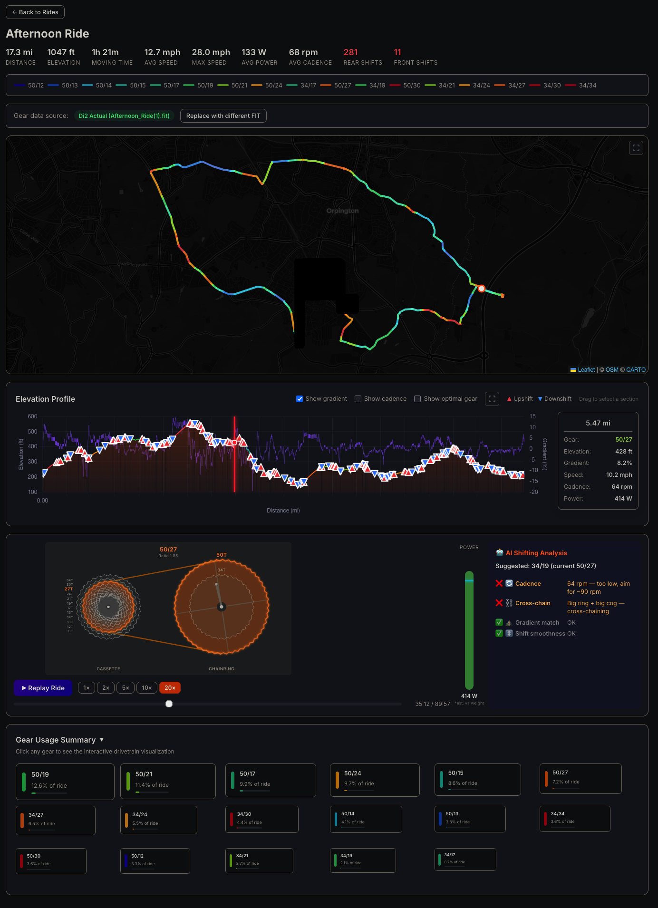

# Di2va — Setup Guide

## Why Di2va?

I'm a keen cyclist — nothing serious, very much an amateur — but I find the tech side of riding genuinely interesting. I run a Shimano Di2 electronic groupset and was increasingly frustrated that **Strava still does not include Di2 electronic shifter data in its ride analysis**. The gear data is right there in the FIT file uploaded by my bike computer, but Strava just ignores it.

To me, understanding how I use my gears is really useful. Am I cross-chaining? Am I spending all my time in one gear when I could be shifting more? On a long climb, did I run out of gears or was I pacing my shifting well? These are exactly the kinds of questions a tool like this can answer.

I was inspired by [Di2Stats.com](https://di2stats.com) — it's a great service that does something similar. Check it out if you haven't already. Di2va takes a different approach by running entirely on your own machine and connecting directly to your Strava account via the API.

---

## How It Works — Data Processing & Privacy

**All data processing happens on your local machine.** Here's exactly what goes where:

| What | Where it's processed | Where it's sent |
|------|---------------------|-----------------|
| Your Strava credentials (Client ID, Secret) | Stored in `.env.local` on your machine (gitignored) | Sent to Strava's OAuth server (`strava.com`) to authenticate |
| OAuth access/refresh tokens | Stored in an Express session cookie in your browser | Sent to Strava's API with each request |
| Activity list, GPS streams, elevation, cadence, power | Fetched from Strava's API → processed in Node.js on your machine | Nowhere — stays on your machine |
| FIT files (Di2 gear shift data) | Parsed locally by `fit-file-parser` on your machine | Nowhere — stays on your machine |
| The Di2va web UI | Served from `localhost:3000` on your machine | Nowhere — it's a local web app |

**No data is sent to any third-party service.** The only network traffic is between your machine and Strava's API (which you already authorised when you created your Strava account). Map tiles are loaded from CARTO's CDN (standard OpenStreetMap tiles).

---

## Step-by-Step: Connecting to the Strava API

### Step 1 — Create a Strava API Application

You need your own Strava API "application" — this is free and takes about 60 seconds. It gives you a Client ID and Client Secret that Di2va uses to talk to Strava on your behalf.

1. **Log in to Strava** in your browser
2. Go to **[https://www.strava.com/settings/api](https://www.strava.com/settings/api)**

> 
>
> *You'll see the "My API Application" page. If you've never created one, it will show a form.*

3. Fill in the application details:

| Field | Value |
|-------|-------|
| **Application Name** | `Di2va` (or anything you like) |
| **Category** | `Visualizer` |
| **Club** | *(leave blank)* |
| **Website** | `http://localhost:3000` |
| **Authorization Callback Domain** | `localhost` |
| **Description** | *(optional — e.g. "Di2 gear visualization")* |

> 
>
> *The key field is **Authorization Callback Domain** — it must be exactly `localhost`.*

4. Click **Create** (or **Update** if editing an existing app)

5. You'll now see your **Client ID** (a number like `12345`) and **Client Secret** (a long hex string). **Keep this page open** — you'll need both values in the next step.

> 
>
> *Your Client ID and Client Secret are shown on this page. The secret is hidden by default — click to reveal it.*

---

### Step 2 — Install Di2va

Make sure you have **Node.js 18+** installed. Then:

```bash
git clone https://github.com/vinfnet/Di2va.git
cd Di2va
npm install
```

---

### Step 3 — Start Di2va

```bash
npm start
```

You'll see:

```
🚴 Di2va running at http://localhost:3000

  ⚡ First-time setup required!
  → Open http://localhost:3000/setup to configure your Strava API credentials
```

Open **[http://localhost:3000](http://localhost:3000)** in your browser.

---

### Step 4 — Enter Your Strava Credentials

On first run, Di2va redirects you to the setup page:

> 
>
> *The setup page asks for your Client ID and Client Secret from Step 1.*

1. **Paste your Client ID** from the Strava API page
2. **Paste your Client Secret**
3. Leave **Session Secret** blank (it auto-generates a secure one)
4. Click **Save & Connect to Strava →**

Your credentials are saved to a `.env.local` file on your machine. This file is gitignored and never committed to the repository.

---

### Step 5 — Authorise with Strava

After saving your credentials, you'll be redirected to Strava's authorisation page:

> 
>
> *Strava asks you to confirm that Di2va can read your activity data. The permissions requested are `read` and `activity:read_all`.*

Click **Authorize** to grant Di2va access to your activities.

---

### Step 6 — Browse Your Rides

After authorising, you'll be taken to the main Di2va interface. Your recent cycling activities are listed on the left:

> 
>
> *Click any ride to load it. The map shows your route colored by gear, and the elevation profile shows gear usage over time.*

---

### Step 7 — View Di2 Gear Data

Click a ride to load it. If the ride has a FIT file with Di2 data, the gear information is automatically extracted and displayed:

- **Route map** — colored by gear combination (red = easy, blue = hard)
- **Elevation profile** — hover to see gear, speed, cadence, and gradient at any point
- **Gear statistics** — percentage of time in each gear, click any gear to see the interactive drivetrain visualization

> 
>
> *A ride loaded with Di2 gear data. The map shows your route colored by gear combination, the elevation profile shows gear shifts and gradient, the hover panel shows live data at any point, and the gear usage summary breaks down time in each gear.*

If no FIT file is available, Di2va estimates gears from cadence and speed data.

---

### Step 8 — Configure FIT File Library (Optional)

If Di2va can't automatically download the FIT file from Strava (this depends on how you upload rides), you can point it at a folder of FIT files:

1. Click the **⚙ Settings** icon
2. Enter the path to your FIT files folder (e.g. `~/Downloads`)
3. Di2va will scan this folder and match FIT files to Strava activities by timestamp

> 
>
> *Point Di2va at your Downloads folder (or wherever your bike computer exports FIT files).*

---

## FIT Files — Why They're Needed and Privacy Considerations

### Why FIT files?

Strava's API provides activity data like GPS coordinates, elevation, cadence, speed, and power — but it **does not include Di2 electronic gear shift data**. That information is only recorded in the **original FIT file** uploaded by your bike computer (Garmin, Wahoo, etc.).

The FIT (Flexible and Interoperable Data Transfer) file is a binary format developed by Garmin that stores every data point your bike computer records during a ride. Di2va needs access to this file to extract the gear change events that the Shimano Di2 system logs.

### How Di2va gets FIT files

Di2va tries to obtain the FIT file automatically, in this order:

1. **FIT Library match** — If you've configured a FIT library folder (e.g. `~/Downloads`), Di2va scans it for a file whose timestamp matches the Strava activity
2. **Strava API export** — Di2va’s server fetches the original file via Strava’s `export_original` endpoint using your OAuth token. This happens server-side — no browser popup or download notification appears. The file is held in memory, parsed, and never written to disk.
3. **Hidden browser download** — If the API approach fails (this endpoint isn’t officially supported by Strava), a silent background download is attempted using your browser’s Strava session cookies. The file is saved to your system’s default download folder (auto-detected, typically `~/Downloads`). **After the gear data is successfully extracted, the FIT file is automatically deleted.**
4. **Manual upload** — You can always drag-and-drop or upload a FIT file manually

> **Note on auto-delete:** FIT files downloaded via the browser fallback (step 3) are automatically deleted from your download folder after Di2va has successfully parsed the gear data. This only happens when using the default download folder — if you’ve configured a custom FIT Library folder in Settings, files in that folder are **never** deleted (they’re assumed to be your permanent archive).

### What's in a FIT file — privacy warning

> **⚠️ FIT files contain privacy-sensitive data.** Treat them like you would your location history.

A typical cycling FIT file contains:

| Data | Privacy concern |
|------|----------------|
| **GPS coordinates** | Your exact route, including start/end locations (often your home) |
| **Timestamps** | Exact times you were at each location |
| **Heart rate** | Personal health/biometric data |
| **Power output** | Personal fitness data |
| **Device serial numbers** | Identifies your specific bike computer and sensors |
| **Di2 gear shifts** | Not particularly sensitive, but linked to all the above |

### Recommendations

- **Don't share FIT files publicly** unless you've stripped GPS data or are comfortable with the location data being visible
- **Be careful with the FIT Library folder** — if you point Di2va at a folder, it indexes all `.fit` files in it. Make sure it doesn't contain files you don't want processed
- **Di2va never uploads your FIT files anywhere** — they are read and parsed locally on your machine. The parsed gear data stays in your browser session and is never sent to any external service
- **Auto-cleanup of downloads** — when Di2va downloads a FIT file from Strava via the browser fallback, it automatically deletes the file from your download folder after successfully extracting the gear data. If you’ve configured a custom FIT Library folder, files there are never deleted.
- **Strava's own privacy controls** still apply — Di2va can only access activities that your Strava privacy settings allow the API to read

---

## Troubleshooting

| Problem | Solution |
|---------|----------|
| **"Not authenticated" error** | Make sure the Authorization Callback Domain in your Strava API app is set to exactly `localhost` |
| **No gear data shown** | The ride may not have a FIT file with Di2 data. Try configuring the FIT Library folder in Settings |
| **Activities not loading** | Check your Strava API credentials are correct. Try restarting with `npm start` |
| **"Token expired" errors** | Di2va auto-refreshes tokens, but if your session expired, click "Connect with Strava" to re-authenticate |
| **Can't see Di2 shifts** | Make sure your Di2 system is configured to record gear data in your bike computer's FIT output |

---

## Uninstalling — Revoking Strava Access

If you no longer want to use Di2va, you should revoke its access to your Strava account and clean up the local files. Here's how:

### 1. Revoke access in Strava

This is the most important step — it immediately stops Di2va (or anyone with your credentials) from accessing your Strava data.

1. Log in to **[Strava](https://www.strava.com)** in your browser
2. Go to **[Settings → My Apps](https://www.strava.com/settings/apps)** (or click your profile picture → Settings → My Apps)
3. Find **Di2va** (or whatever you named the application) in the list of connected apps
4. Click **Revoke Access**

This immediately invalidates all OAuth tokens. Di2va will no longer be able to read your activities.

### 2. Delete the Strava API application (optional)

If you also want to remove the API application itself:

1. Go to **[https://www.strava.com/settings/api](https://www.strava.com/settings/api)**
2. Delete the application

This removes the Client ID and Client Secret entirely. You'd need to create a new one if you ever wanted to use Di2va again.

### 3. Clean up local files

On your machine, remove the credentials and any cached data:

```bash
# Delete the credentials file
rm .env.local

# (Optional) Delete the entire Di2va folder
cd ..
rm -rf Di2va
```

The `.env.local` file contains your Strava Client ID, Client Secret, and session secret. Deleting it ensures no credentials remain on disk.

### What about my Strava data?

Di2va doesn't store any of your Strava data persistently. Activity data, GPS tracks, and gear information exist only in your browser session while you're using the app. Once you close the browser tab (or the server stops), that data is gone. There is no database, no cache file, and no cloud storage to clean up.

---

## Data Flow Diagram

```
┌─────────────────┐     OAuth      ┌──────────────────┐
│   Your Browser   │◄─────────────►│   Strava.com     │
│  localhost:3000  │   (HTTPS)     │   (OAuth + API)  │
└────────┬────────┘               └──────────────────┘
         │                                  ▲
         │ HTTP                             │ HTTPS
         ▼                                  │
┌─────────────────┐    API calls    ────────┘
│   Di2va Server   │───────────────►
│  (your machine)  │
│   Node.js/Express│
└────────┬────────┘
         │
         │ Reads FIT files
         ▼
┌─────────────────┐
│  Your FIT Files  │
│ (local disk)     │
└─────────────────┘
```

**Everything inside the dotted boundary runs on your machine. The only external service contacted is Strava's API.**

---

## Adding Screenshots

The `docs/screenshots/` folder is where you should place actual screenshots. The filenames referenced in this guide are:

| Filename | Description |
|----------|-------------|
| `01-strava-api-settings.png` | Strava API settings page |
| `02-strava-create-app.png` | Strava create application form |
| `03-strava-credentials.png` | Client ID and Secret displayed |
| `04-di2va-setup.png` | Di2va first-run setup page |
| `05-strava-authorize.png` | Strava OAuth consent screen |
| `06-di2va-main.png` | Di2va main interface with activity list |
| `07-di2va-ride.png` | A ride loaded with gear data |
| `08-di2va-settings.png` | FIT library settings dialog |

To add screenshots: take them while following the steps above and save them in `docs/screenshots/` with the filenames listed.

---

## Tested On

This project has been developed and tested with the following setup:

| Component | Version / Model |
|-----------|----------------|
| **Operating System** | macOS 26.3 (Tahoe) |
| **Editor** | Visual Studio Code 1.109.5 |
| **Head Unit** | Garmin Edge 540 |
| **Groupset** | Shimano Di2 Ultegra |
| **Platform** | Strava |

> Other Shimano Di2 groupsets (Dura-Ace, 105) and Garmin head units that record Di2 shifting events to FIT files should also work, but have not been explicitly tested.

---

<sub>

**About this project:** This is entirely AI-generated code, built using [Visual Studio Code](https://code.visualstudio.com/download) with [GitHub Copilot](https://github.com/features/copilot) powered by the **Claude Opus 4.6** model by [Anthropic](https://www.anthropic.com/).

**Author:** [vinfnet](https://github.com/vinfnet) — This is a personal project and is not affiliated with, endorsed by, or connected to my employer in any way. I do not endorse any of the technologies, products, or services mentioned (Strava, Shimano, Di2, Garmin, etc.) — I simply find this a useful way to experiment with cycling data and AI-assisted development.

Download VS Code: [https://code.visualstudio.com/download](https://code.visualstudio.com/download)

</sub>
